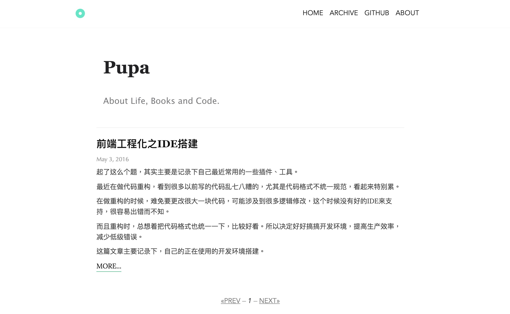

# pupa-theme



## 安装

``` bash
hexo init blog && cd blog
npm i
npm i --save hexo-renderer-jade hexo-generator-feed hexo-generator-sitemap hexo-browsersync hexo-generator-archive
git clone git@github.com:xwartz/pupa-theme.git themes/pupa
```

## 启用

修改 `_config.yml` 的 `theme` 配置项为 `pupa`:

```yaml
theme: pupa

# 在归档页面显示所有文章
# 需要上面安装的 hexo-generator-archive 插件支持
archive_generator:
    per_page: 0
    yearly: false
    monthly: false
    daily: false
```

## 更新

``` bash
cd themes/pupa
git pull
```

## License

MIT
